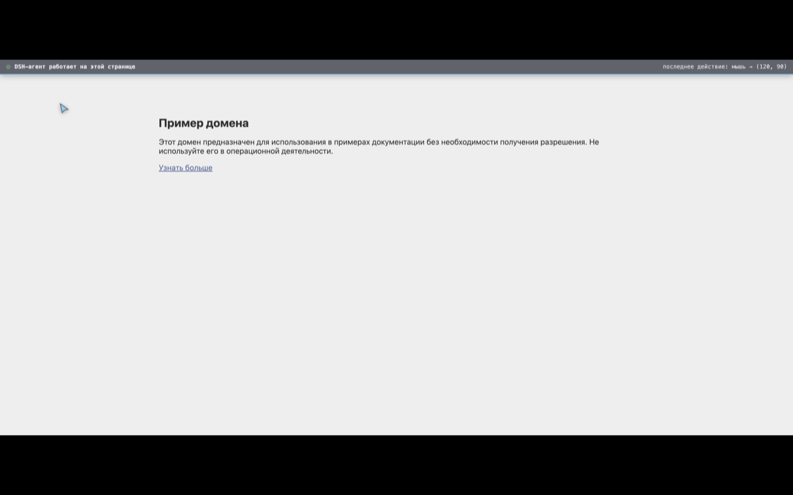

<div align="center">

# 🤖 DSH Browser Bridge

**Дайте вашему ИИ-агенту руки в настоящем Chrome — наглядно, безопасно и с возможностью самоулучшения.**

[](LICENSE)
[](https://github.com/HEDELKA/prodjest/releases)
[](https://github.com/HEDELKA/prodjest/stargazers)

</div>

Chrome-расширение + локальный мост, которые позволяют агенту (DeepSeek Harness, Claude Code, Codex и др.)
управлять **вашим реальным браузером Chrome** через `chrome.debugger` (CDP).
Никакого отдельного браузера, Playwright или MCP — агент работает именно в том Chrome,
где установлено расширение: с вашими логинами, куками и профилем.

```
агент ──HTTP──▶ мост (127.0.0.1:8787) ──WebSocket──▶ расширение Chrome
                                                       │
                                                       ▼
                                               chrome.debugger → ваши вкладки
```



## ✨ Возможности

- **Человеческие действия** — `human_click` / `human_move` / `human_type`: плавные
  траектории мыши по кривой Безье с естественными паузами и джиттером (меньше шансов
  срабатывания антибот-защиты).
- **Всё видно** — баннер «DSH-агент работает на этой странице», призрачный курсор
  следует за каждым движением, клики подсвечивают элемент кольцом и обводкой.
- **Вкладки с подписью** — вкладки агента объединяются в синюю группу **«DSH-агент»**
  и получают заголовок `🤖 DSH · <заголовок страницы>`: видно, не открывая вкладку.
- **Фоновый режим** — вкладки агента открываются неактивными, ваш фокус никто не перехватывает.
- **Само-обновление** — агент перезагружает расширение удалённо (`reload_extension`)
  и может **улучшать код собственных «рук» без участия человека**.
- **Локально и приватно** — мост слушает только `127.0.0.1`, соединение защищено
  случайным токеном; данные не покидают ваш компьютер.

## 🚀 Быстрый старт

1. **Сервер**: `node server/index.mjs` — токен появится в `server/token.txt`.
2. **Расширение**: `chrome://extensions` → «Режим разработчика» → «Загрузить распакованное» →
   выберите папку `extension/`.
3. **Токен**: иконка расширения → вставьте токен → «Сохранить и переподключить».
   Статус «подключено к мосту» — всё работает.
4. **Команды**: `./bridge.sh list_tabs`, `./bridge.sh open_tab /tmp/p.json`,
   `./bridge.sh human_click /tmp/xy.json <tabId>` — полный список в `AGENTS.md`.

## 🤖 Для агентов: самообучающаяся машина

Этот репозиторий — не просто расширение. **Агент, работающий в нём, может улучшать
сам себя**: править `extension/background.js`, применять изменения мгновенно через
`reload_extension` и проверять результат через мост — замкнутый цикл без человека.

Полная инструкция для агентов (команды, паттерн добавления новых команд, оверлей,
правила безопасности, чек-лист тестирования): **[AGENTS.md](AGENTS.md)**.

## 🔒 Безопасность

- Сервер слушает **только** `127.0.0.1` и требует токен; расширение подключается
  только к `ws://127.0.0.1:*` с проверкой Origin.
- Управляемые вкладки помечаются жёлтой плашкой Chrome «debugging» — всегда видно,
  когда идёт управление.
- Кнопка «Отключить управление всеми вкладками» в попапе — мгновенная остановка.
- Политика конфиденциальности: [PRIVACY.md](browser-bridge/PRIVACY.md).

## 📦 Chrome Web Store

Пакет для публикации: `dsh-browser-bridge-v0.3.0.zip` в
[Release v0.3.0](https://github.com/HEDELKA/prodjest/releases/tag/v0.3.0).
Описание для листинга (EN/RU): `browser-bridge/release/store-description.md`.

## 📄 Лицензия

[MIT](LICENSE)
